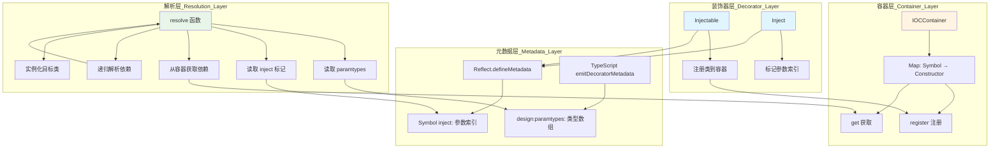
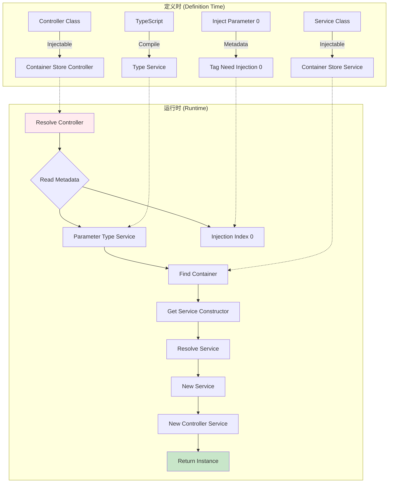

# IOC (Inversion of Control)

A TypeScript implementation of Dependency Injection using decorators and reflect-metadata.

## 实现原理 (Implementation Principles)

### 核心机制 (Core Mechanisms)

1. **装饰器拦截 (Decorator Interception)**: 使用 `@Injectable()` 和 `@Inject()` 装饰器标记类和参数
2. **元数据存储 (Metadata Storage)**: 使用 `reflect-metadata` 存储类型信息和注入标记
3. **依赖解析 (Dependency Resolution)**: 通过 `resolve()` 函数递归解析和实例化依赖
4. **容器管理 (Container Management)**: IOCContainer 存储和管理所有可注入的类

### 关键技术点 (Key Technical Points)

- **TypeScript Decorator Metadata**: `emitDecoratorMetadata: true` 让 TypeScript 自动生成类型元数据
- **Reflect Metadata API**: 
  - `design:paramtypes` - 获取构造函数参数类型
  - 自定义 `Symbol('inject')` - 标记哪些参数需要注入
- **SWC Transform**: Vitest 使用 SWC 而非 esbuild 来支持装饰器元数据

## 工作流程图 (Workflow Diagram)


## 架构图 (Architecture Diagram)




## 数据流示例 (Data Flow Example)



## 核心代码流程 (Core Code Flow)

### 1. 装饰器标记 (Decorator Marking)

```typescript
@Injectable()  // ← 注册到容器
class Service {
  getName() { return 'A' }
}

@Injectable()  // ← 注册到容器
class Controller {
  constructor(@Inject() readonly service: Service) {}
  //          ^^^^^^^^^ 标记参数0需要注入
}
```

### 2. 元数据存储 (Metadata Storage)

```
Controller 类的元数据:
├── design:paramtypes → [Service]     (TypeScript 生成)
└── Symbol('inject')  → [0]           (@Inject 生成)
```

### 3. 依赖解析 (Dependency Resolution)

```typescript
resolve(Controller)
  ↓
读取 paramtypes: [Service]
读取 injections: [0]
  ↓
参数0需要注入 Service 类型
  ↓
从容器获取 Service 构造器
  ↓
递归: resolve(Service) → new Service()
  ↓
new Controller(serviceInstance)
```

## 使用示例 (Usage Example)

```typescript
import { Injectable, Inject, resolve } from './ioc'

// 1. 定义可注入的服务
@Injectable()
class DatabaseService {
  query() { return 'data' }
}

// 2. 定义依赖其他服务的类
@Injectable()
class UserService {
  constructor(@Inject() private db: DatabaseService) {}
  
  getUser() {
    return this.db.query()
  }
}

// 3. 解析并使用
const userService = resolve(UserService)
console.log(userService.getUser()) // 'data'
```

## 技术栈 (Tech Stack)

- **TypeScript**: 装饰器和类型系统
- **reflect-metadata**: 运行时元数据 API
- **SWC**: 支持装饰器元数据的转译器
- **Vitest**: 测试框架

## 参考资源 (References)

- AST Explorer: https://astexplorer.net
- Reflect Metadata: https://github.com/rbuckton/reflect-metadata
- TypeScript Decorators: https://www.typescriptlang.org/docs/handbook/decorators.html
